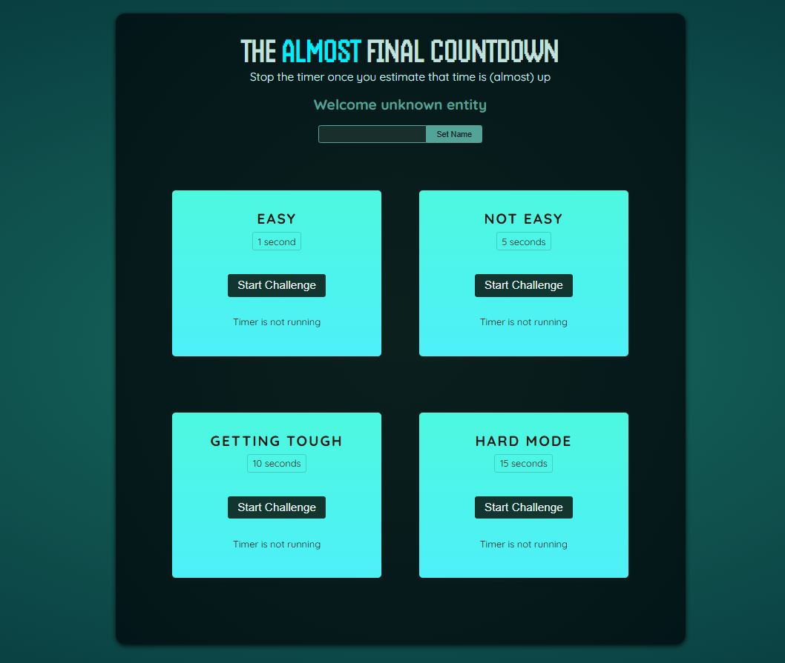

# Countdown 🎮

**Countdown** is an engaging and interactive game where the objective is to stop the timer at the exact given time (in seconds). Your precision determines your score, making it a fun challenge to test your timing skills!



---

## 🛠️ Tech Stack

This project is developed using the following technologies:

- **HTML**: Structure of the game.
- **CSS**: Styling and animations.
- **JavaScript**: Core game logic.
- **React**: Component-based UI framework for dynamic rendering.
- **Vite**: Development environment and build tool for fast performance.

---

## 🎯 Features

- **Interactive Gameplay**: Simple yet addictive gameplay mechanism.
- **Score System**: Earn points based on how close you are to the target time.
- **Responsive Design**: Optimized for various screen sizes.
- **Fast Performance**: Powered by Vite for quick loading and smooth gameplay.

---

## 🚀 Getting Started

### Prerequisites

Make sure you have the following installed on your system:

- Node.js (v14 or later)
- npm or yarn

### Installation

1. Clone this repository:
   ```bash
   git clone https://github.com/ummamali/countdown.git
   cd countdown
   npm run dev
   ```
